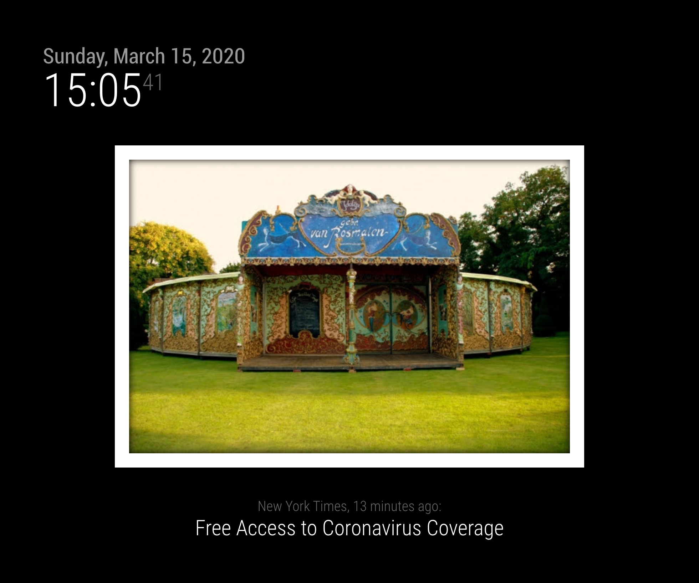
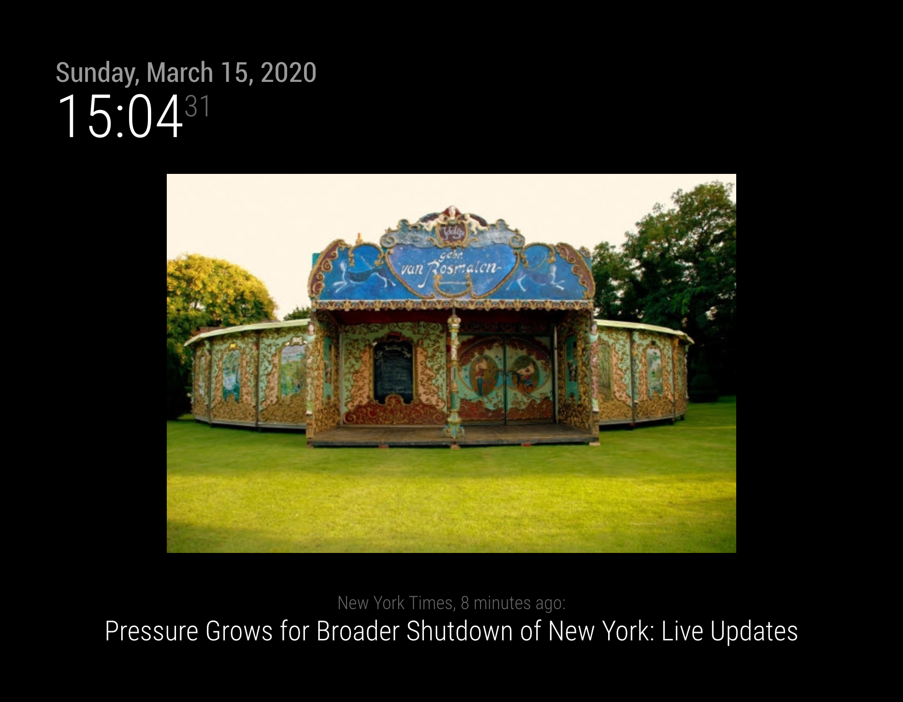
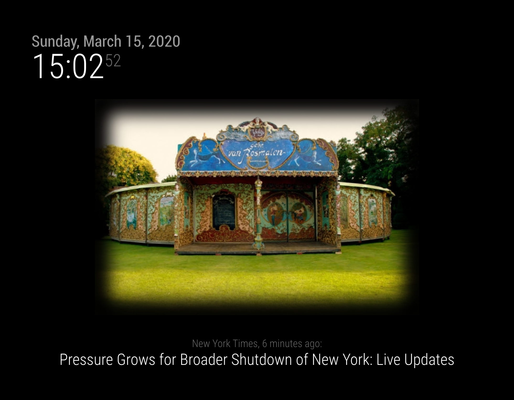

# MMM-GoogleDriveSlideShow
Display your photos from files stored in Google Drive

Inspired by [MMM-GooglePhotos](https://github.com/eouia/MMM-GooglePhotos/) and [MMM-GoogleBirthdaysProvider](https://github.com/PalatinCoder/MMM-GoogleBirthdaysProvider)

## Screenshot


## Regular installation

1. Install Module
```sh
git clone https://github.com/clegallic/MMM-GoogleDriveSlideShow.git
cd MMM-GoogleDriveSlideShow
npm install
```

### Get `Auth` and `FolderId`
1. Go to [Google API Console](https://console.developers.google.com/)
2. From the menu bar, select a project or create a new project.
3. To open the Google API Library, from the Navigation menu, select `APIs & Services > Library`.
	Don't forget to enable the Google API Services.
4. Search for `Google Drive API`. Select the correct result and click Enable.
5. Then, from the menu, select `APIs & Services > Credentials`.
6. On the Credentials page, click `Create Credentials > OAuth client ID`.
7. Select your Application type as `Other` and submit. (Before or After that, you might be asked for making consent screen. do that.)
8. Then, you can download your credential json file from list. Downloaded file name would be `client_secret_xxxx...xxx.json`. rename it as `credentials.json` and save it to your `MMM-GoogleDriveSlideShow/secrets` directory.
9. Now, open your terminal(not via SSH, directly in your RPI).
```shell
cd ~/MagicMirror/modules/MMM-GoogleDriveSlideShow
npm run token:generate
```
10. At first execution, It will display a link that will ask you to login google account and to consent your allowance.
11. After consent, some code (`4/ABCD1234xxxx...`) will be appeared. copy it and return to your terminal. paste it for answer of prompt in console.
12. Now set your `config.js` (next chapter)

## Using this module
To use this module, add it to the modules array in the config/config.js file:
```javascript
var config = {
    modules: [
		{
			module: "MMM-GoogleDriveSlideShow",
			position: "bottom_bar",
			config: {
				rootFolderId: null,
				maxFolders: 10, 
				maxResults: 100,
				playMode: "AUTO",
				nextOnNotification: null,
				stopOnNotification: null,
				startOnNotification: null,
				refreshDriveDelayInSeconds: 24 * 3600, 
				refreshSlideShowIntervalInSeconds: 10,
				maxWidth: "800",
				maxHeight: "600",
				theme: "whiteFrame",
				opacity: 1,
				debug: false
			}
		}
	]
};
```

## Configuration options

| Option                 | Description
|------------------------|------------
| `rootFolderId`         | Google Drive root folder id, or `null` for root folder<br><br>**Type:** `string`<br> **Default value:** `null`
| `maxFolders`           | Maximum number of sub-folders to scan if rootFolderId != `root` <br><br>**Type:** `integer`<br> **Default value:** `10`
| `maxResults`           | Maximum of images to load from Google Drive <br><br>**Type:** `integer`<br> **Default value:** `100`
| `playMode`             | Slideshow play mode : `AUTO` (automatic) or `NOTIFICATION` (only on the notification configured with `nextOnNotification`) <br><br>**Type:** `string`<br> **Default value:** `AUTO`
| `nextOnNotification` | Change image only when this notification is received. Automatic refresh otherwise if `null` <br><br>**Type:** `string`<br> **Default value:** `null`
| `stopOnNotification` | Stop slideshow when this notification is received <br><br>**Type:** `string`<br> **Default value:** `null`
| `startOnNotification` | Stop slideshow when this notification is received<br><br>**Type:** `string`<br> **Default value:** `null`
| `refreshDriveDelayInSeconds`| How often Google Drive cache is refresh (fetch new photos, update existings) <br><br>**Type:** `integer` (seconds)<br> **Default value:** `24 * 3600`
| `refreshSlideShowIntervalInSeconds`| How often the image on the slideshow is refreshed<br><br>**Type:** `integer` (seconds) <br> **Default value:** `10`
| `maxWidth`             | Maximum width of the image displayed <br><br>**Type:** `integer` (pixels)<br> **Default value:** `800`
| `maxHeight`            | Maximum height of the image displayed  <br><br>**Type:** `integer` (pixels) <br> **Default value:** `600`
| `theme`                | Name of CSS class to use for theme : `none`, `insetShadow` or `whiteFrame`. See below for examples of these themes<br><br>**Type:** `string` <br> **Default value:** `whiteFrame`
| `opacity`              | Resulting image opacity. Consider reducing this value if you are using this module as a background picture frame<br><br>**Type:** `float` (below one)<br> **Default value:** `1`
| `mode`                 | "cover" or "contain"<br><br>**Type:** `string`<br> **Default value:** `contain`
| `debug`                | Display debug informations in Electron and NodeJS consoles / logs<br><br>**Type:** `boolean`<br> **Default value:** `false`

## Last Tested;
- MagicMirror : v2.10.1
- node.js : 8.16.2 & 10.17.0

## Themes

### White Frame (default)


### None


### Inset Shadow


## TODO

- Add rootFolderId in cache to compare any change and reset if any
- Display a message on the Mirror while reloading the cache
- Explain who to get the folderId in Google Drive
- Add option to display filename, date and parent folder name
- Add option to choose mimetype of files to search
- Detect and correct photo orientation when portait is displayed as landscape
- Allow multiple root folders Ids
- Allow memory only cache for read-only MM